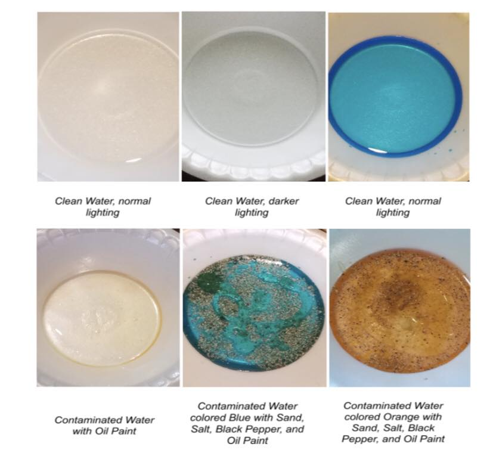

# Artificial-Intelligence-for-Clean-Water-with-AQUASIGHT

Use of Convolutional Neural network for detecting water impurity. Achieves 96% accuracy in preliminary tests & highly efficient in assessing the transparency levels of particular samples.

Great work by Thomas Jefferson High School for Science and Technology and the Department of Computer Science at the University of Maryland

Read more: https://arxiv.org/pdf/1907.07573.pdf
